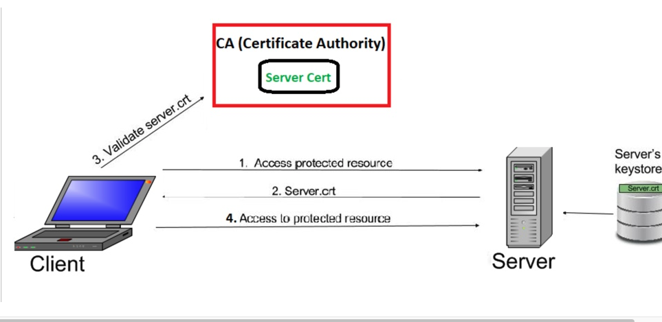
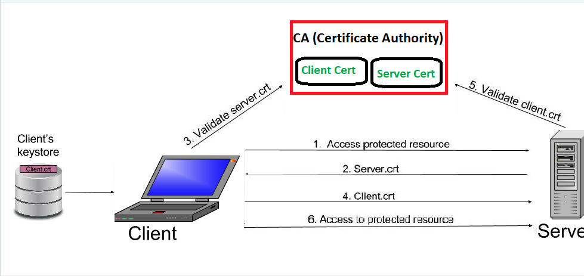
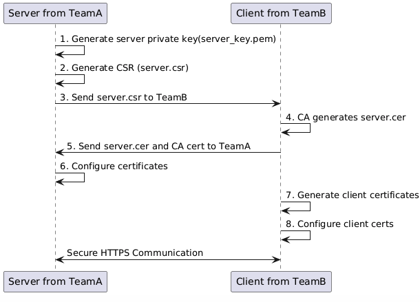

# Https one-way-ssl
In one way SSL, only client validates the server to ensure that it receives data from the intended server. For implementing one-way SSL, server shares its public certificate with the clients. Below is the high level description of the steps involved in establishment of connection and transfer of data between a client and server in case of one-way SSL:

- 1. Client requests for some protected data from the server on HTTPS protocol. This initiates SSL/TLS handshake process.
- 2. Server returns its public certificate to the client along with server hello message.
- 3. Client validates/verifies the received certificate. Client verifies the certificate through certification authority (CA) for CA signed certificates.
- 4. SSL/TLS client sends the random byte string that enables both the client and the server to compute the secret key to be used for encrypting subsequent message data. The random byte string itself is encrypted with the server’s public key.
- 5. After agreeing on this secret key, client and server communicate further for actual data transfer by encryping/decrypting data using this key. 

# Https two-way-ssl
Contrary to one-way SSL; in case of two-way SSL, both client and server authenticate each other to ensure that both parties involved in the communication are trusted. Both parties share their public certificates to each other and then verification/validation is performed based on that.

Below is the high level description of the steps involved in establishment of connection and transfer of data between a client and server in case of two-way SSL:

- 1. Client requests a protected resource over HTTPS protocol and the SSL/TSL handshake process begins.
- 2. Server returns its public certificate to the client along with server hello.
- 3. Client validates/verifies the received certificate. Client verifies the certificate through certification authority (CA) for CA signed certificates.
- 4. If Server certificate was validated successfully, client will provide its public certificate to the server.
- 5. Server validates/verifies the received certificate. Server verifies the certificate through certification authority (CA) for CA signed certificates.
- 6. After completion of handshake process, client and server communicate and transfer data with each other encrypted with the secret keys shared between the two during handshake. 

## 💡 two way ssl tips
- 1. To implement https two-way-ssl, need SSL certificate support. 
    The following is a certificate generation flow: 
     
- 2. List of Certificates generate requirement:

    | File            | Equipment    | Provider | Description                        |
    | --------------- | ------------ | -------- | ---------------------------------- |
    | server_key.pem | Cloud        |  TeamA | server private key                 |
    | server.csr      | Cloud        |  TeamA | server certificate signing request |
    | server.cer      | Cloud        |  TeamB | server certificate                 |
    | client.pem      | Device       |  TeamB | client private key                 |
    | client.csr      | Device       |  TeamB | client certificate signing request |
    | client.cer      | Device       |  TeamB | client certificate                 |
    | CA              | Cloud/Device |  TeamB | Certificate authority              |
