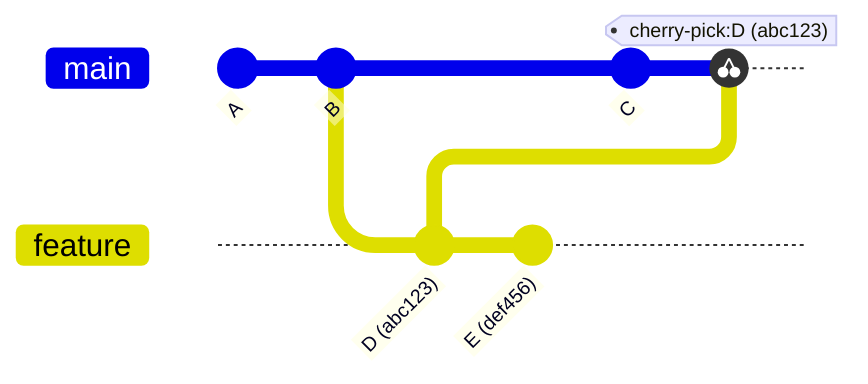
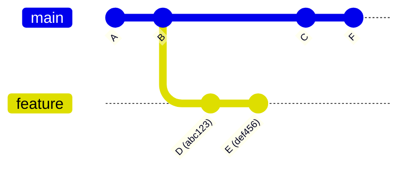
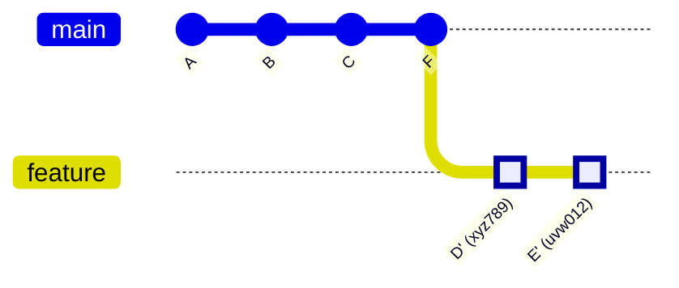
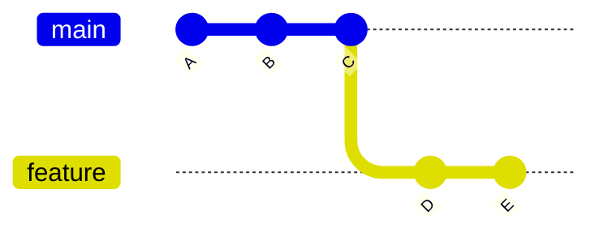
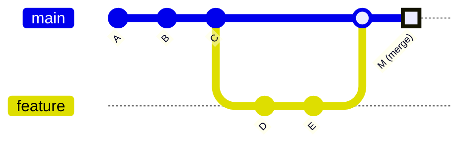
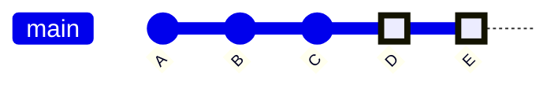
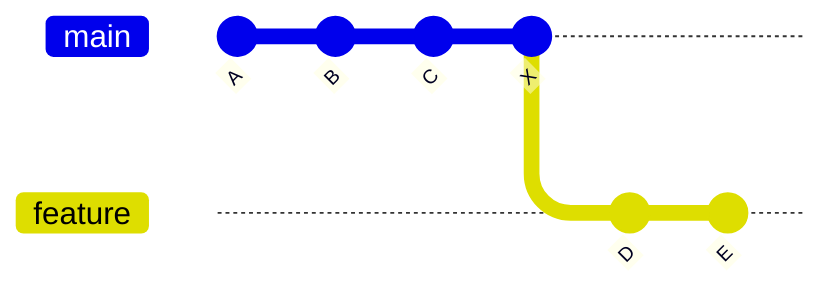
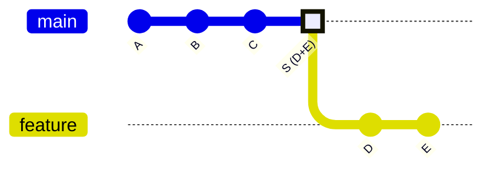

## Description

This section contains frequently used Git commands for daily development workflow. Each command includes:
- Purpose and usage
- Common scenarios
- Important flags and options

## Git Documents
[git book](https://git-scm.com/book/zh/v2)<br>
[pro git book](https://www.progit.cn/)

## Git config command

```git
// List all configurations (system, global, and local)
git config -l 

// List only local repository configurations (.git/config)
git config --local -l 

// Configure user info for current repository
git config --local user.name 
git config --local user.email
```

## Git fetch command

```git
// Clean up stale remote references and update tags
git fetch --all --prune --tags

// Synchronize branches and tags
git fetch --all --tags

// Fetch remote tags
git fetch --tags
git fetch --tags --force
```

## Git tag command

```git
// Delete all local tags (use with caution!)
git tag -l | xargs -n 1 git tag -d
```

## Git ls-remote command
``` git
// ls remote tags
git ls-remote --tags
```

## Git cherry-pick command
Cherry-pick creates a new commit with:
- New commit SHA (hash)
- Same commit message (by default)
- Same author information
- New timestamp

Example commit history:

**Note**: Cherry-pick creates a new commit with a different SHA (xyz789) but same content as original D (abc123).

### Git cherry-pick usage
``` git
// Cherry-pick with origin commit reference 
git cherry-pick -x <commit-hash>

// Multiple commits
git cherry-pick <commit1>..<commit2>

// Skip commit creation with `--no-commit`
git cherry-pick --no-commit <commit-hash> 
```

## Git rebase command
Rebase changes the base of your branch and creates new commits for each commit in your branch.

**Before rebase:**


**After rebase (git rebase main):**


**Rebase Process:**
1. Original commits D (abc123) and E (def456) are removed from feature branch
2. Feature branch is moved to latest main commit (F)
3. New commits D' (xyz789) and E' (uvw012) are created with same content but different SHAs
### git rebase usage
```git
// Basic rebase
git checkout feature
git rebase main

// Interactive rebase
git rebase -i HEAD~3  # Rebase last 3 commits

// Abort rebase
git rebase --abort

// Continue rebase after resolving conflicts
git rebase --continue
```

## Git commit command

### Git Merge Strategies
### --no-ff (No Fast Forward)
Creates a new merge commit even when a fast-forward would be possible.

**Before merge (--no-ff):**


**After merge (--no-ff):**

### --ff (Fast Forward)
Default behavior. If possible, moves the branch pointer forward.

**Before merge (--ff):**


**After merge (--ff):**

### --ff-only
Only allows merge if it can be fast-forwarded.

**Will succeed (--ff-only):**


**Will fail (--ff-only):**

### --squash
Combines all changes into a single new commit.

**Before squash:**


**After squash:**


### git commit usage
``` git
// Amend last commit
git commit -m "message"
git commit --amend
git commit --amend --no-edit
```

## Git submodule command
``` git
// Add submodule 
git submodule add https://github.com/user/sub-project.git lib/sub-project

// Clone repo with submodule
git clone --recursive https://github.com/user/main-project.git
// Or after normal clone:
git submodule update --init --recursive

// Update submodule
git submodule update --remote
git submodule update --remote --merge

// Check submodule status
git submodule status

// Switch to specific commit/branch in submodule
cd lib/sub-project
git checkout <commit-hash/branch>
cd ../..
git add lib/sub-project
git commit -m "Update submodule to <commit-hash/branch>"
```

## Git rm command
``` git
// Remove file from index and working directory
git rm <file>

// Remove file from index only (keep in working directory)
git rm --cached <file>
```
## Git commands combination
``` git
// Remove branch not exist on the remote
1. git fetch --prune
2. git branch -vv | grep ': gone]' | awk '{print $1}' | xargs -r git branch -D


//Init local brach to remote
1. git init
2. git add .
3. git commit -m "Initial commit"
4. git remote add origin git@github.com:user/repo.git
5. git push -u origin main
```
